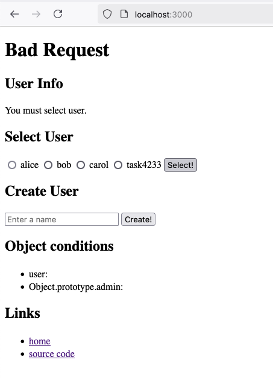
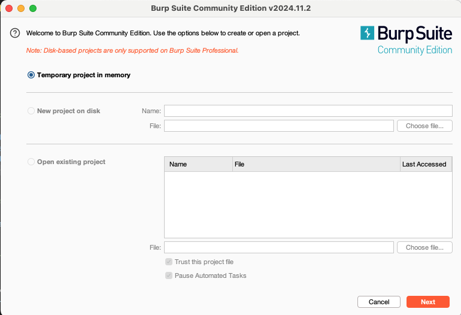
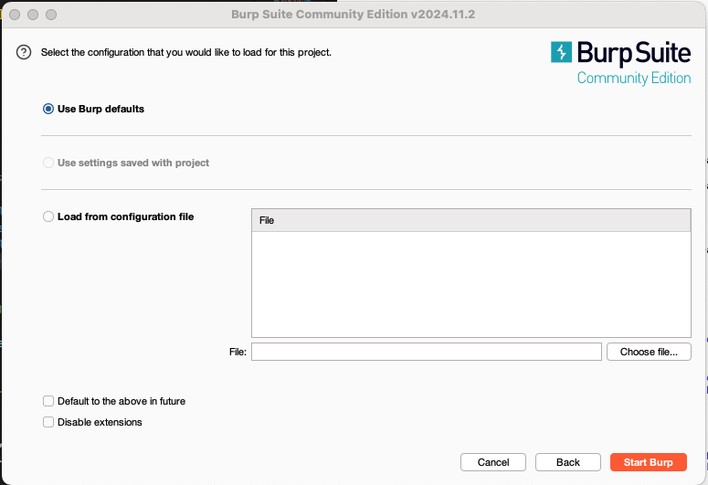
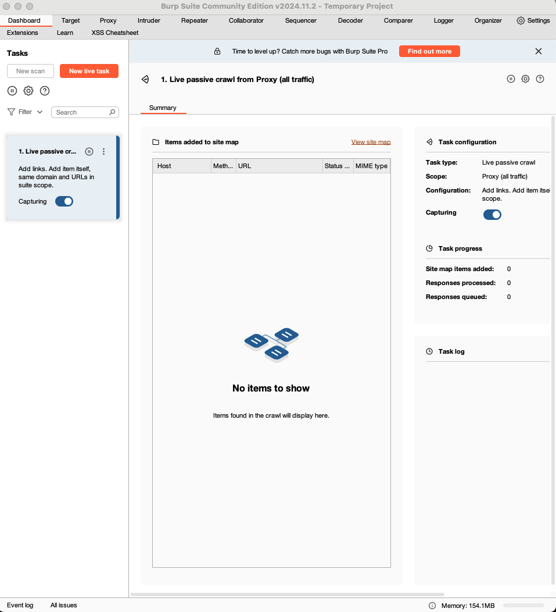
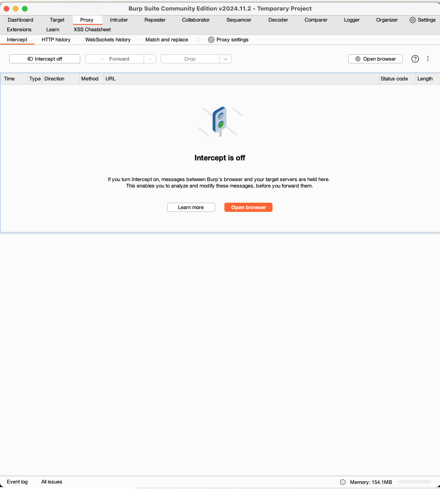
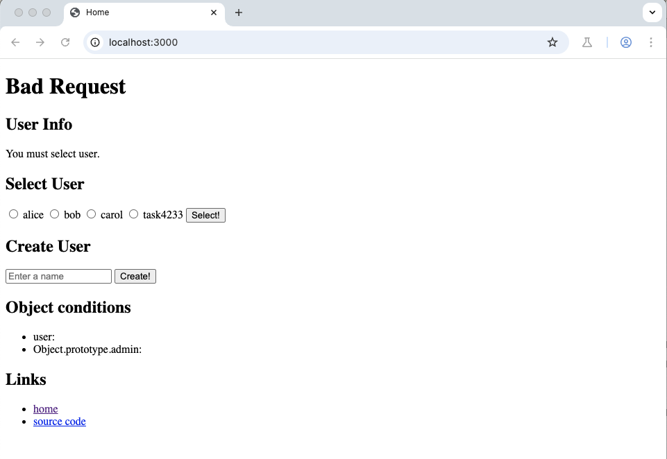

## step1 - 環境構築
講義において、以下のツールを利用する可能性があります。そのため、事前の準備をお願いします。

何か質問がある方は、Xアカウントをお持ちであれば [@task4233](https://x.com/task4233) のDMで聞いていただいても構いません。極力答えます。

- Git
- Docker
- エディタ
- Burp Suite

それぞれのインストール方法は以下に書きます。末尾に動作確認をするセクションがあるので、そちらが動く状態にしておいてください。

## Git
Gitは、分散型のバージョン管理システムです。コードの変更履歴を管理することが可能で、リモート上に存在するGitHubと連携して他人が編集したコードを閲覧、編集することが可能です。

ツールのインストール方法は下記のリンクに従ってください。

- Git
  - [1.5 使い始める - Gitのインストール](https://git-scm.com/book/ja/v2/%E4%BD%BF%E3%81%84%E5%A7%8B%E3%82%81%E3%82%8B-Git%E3%81%AE%E3%82%A4%E3%83%B3%E3%82%B9%E3%83%88%E3%83%BC%E3%83%AB)


ターミナル上で下記のコマンドを実行して、`git version ...`のような表示がされればOKです。

```bash
git version
```

## Docker
DockerはOSレベルの仮想化技術です。ホストOSのカーネルを共有し、アプリケーションごとに隔離された軽量なコンテナを実行します。
このツールにより、環境差異を意識せずにアプリケーションを実行することが可能です。

ツールのインストール方法は下記のリンクに従ってください。

- Docker
  - MacOS: [Install Docker Desktop on Mac](https://docs.docker.com/desktop/setup/install/mac-install/)
  - Windows: [Install Docker Desktop on Windows](https://docs.docker.com/desktop/setup/install/windows-install/)
  - Linux: [Install Docker Desktop on Linux](https://docs.docker.com/desktop/setup/install/linux/)

ターミナルを開き、以下のコマンドを実行して `Hello from Docker!` という文字列が表示されるようにしておいてください。

```
docker run hello-world
```

## エディタ
エディタは、ソースコードを閲覧、編集するために利用するツールです。既に利用しているお好みのソフトウェアがあれば、そちらで問題ありません。

特に希望がなければ、VS Codeが比較的使いやすいのでインストールしておいてください。

- [インストーラのダウンロードページ](https://code.visualstudio.com/download)

エディタが開ける状態にしておいてください。

## Burp Suite
Webアプリケーションのセキュリティテストツールです。
リクエストをプロキシして中身を閲覧したり編集したり、リクエストを新たに作成したりすることも可能です。

有償版(Professional)と無料版(Community Edition)がありますが、今回は無料版(Community Edition)で問題ありません。

- [Installing Burp Suite Professional / Community Edition - PortSwigger](https://portswigger.net/burp/documentation/desktop/getting-started/download-and-install)

アプリケーションを開ける状態にしておいてください。

## 動作確認

動作確認で必要なのは、下記の3ステップです。

1. アプリケーションの起動
2. ソースコードの編集と再起動
3. Burp Suiteによる動作確認


### 1. アプリケーションの起動

ターミナル上で下記のコマンドを実行してください。

```bash
git clone https://github.com/task4233/ctf4b-web-2025-kanazawa
cd ctf4b-web-2025-kanazawa
cd demo-app
docker compose up -d
```

その後、ブラウザで `http://localhost:3000` にアクセスして、下記のページが表示されることを確認してください。


## 2. ソースコードの編集と再起動

次は、このアプリケーションのソースコードを一部変更して再起動してみましょう。

まず、エディタで `ctf4b-web-2025-kanazawa/demo-app/app.js` を開いて35行めあたりを見てください。下記のソースコードが表示されるはずです。

```javascript
// ユーザー情報の模擬データベース（本番ではデータベースや認証システムを使用）
const users = [
    { name: 'alice', admin: false },
    { name: 'bob', admin: false },
    { name: 'carol', admin: false },
];
```

ここに、1行あなたのデータを追加してください。例えば、以下の通りです。

```javascript
const users = [
    { name: 'alice', admin: false },
    { name: 'bob', admin: false },
    { name: 'carol', admin: false },
    { name: 'あなたの名前', admin: false },
];
```

これが出来たら、一旦ファイルを保存してください。

次に、ターミナルを開いて以下のコマンドを実行してください。これは、コードの再読み込みと再起動のためのコマンドです。

```bash
docker compose down
docker compose up --build -d
```

その後、ブラウザを再度読み込み、あなたの名前が追加されていることを確認してください。



## 3. Burp Suiteによる動作確認

最後に、Burp Suiteを用いたリクエストの追跡をしてみましょう。手元のBurp Suiteを開いてください。

最初に以下のような画面が出てくるので、 `Temporary project in memory` を選択して、右下の `Next` ボタンをクリックしてください。



次の画面でも、 `Use Burp defaults` を選択して、右下の `Start Burp` ボタンをクリックしてください。



すると、以下のような最初のページが開くはずです。



ここで、上に並んでいるタブの中で、 `Proxy` を選択してください。すると、以下のような画面が表示されるはずです。



その後、画面右側にある `Open Browser` ボタンをクリックしてください。すると、ブラウザが立ち上がるはずです。そのブラウザのアドレスバーに、先ほどの `http://localhost:3000` を入力してアクセスしてください。

すると、以下のように先ほどと同様のページが表示されるはずです。



ここで、いくつか操作をしてみましょう。ユーザを選択してみたり、ユーザを作成してみたり、ソースコードを見てみたり。

操作が終わったら、Burp Suiteを開きましょう。ここで、 `HTTP history` というタブをクリックして、アクセス履歴を確認してみましょう。

以下の通り、いくつかのアクセスログが確認できるはずです。


ここまできたら、準備は完了です！

当日、お会いできることを楽しみにしています！

